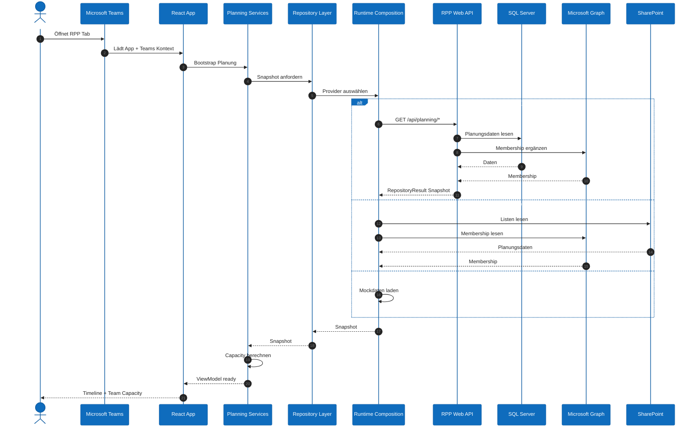
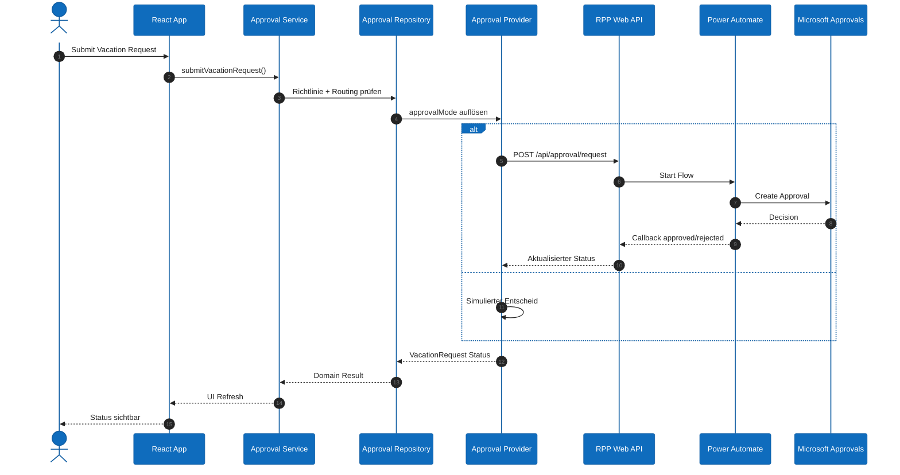
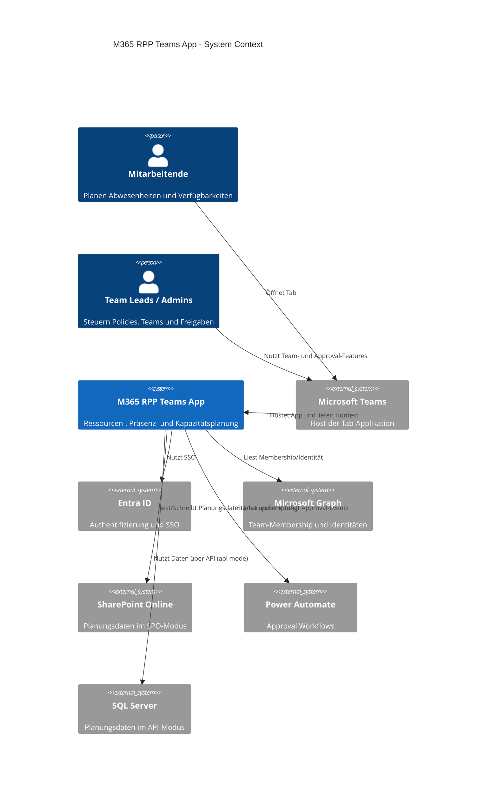
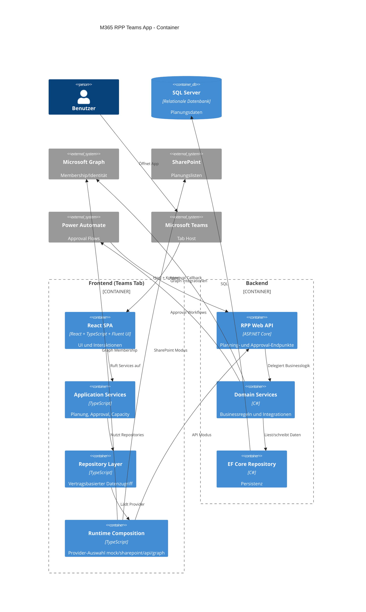

# Architecture Diagrams (Mermaid)

Diese Seite bündelt die wichtigsten Mermaid-Diagramme für Applikation, Architektur und Datenflüsse der M365 RPP Teams App.

## 1) Gesamtarchitektur und Datenflüsse

```mermaid
%%{init: {"theme":"base","themeVariables":{"fontFamily":"Segoe UI, Arial, sans-serif","primaryColor":"#0F6CBD","primaryTextColor":"#FFFFFF","primaryBorderColor":"#115EA3","secondaryColor":"#EFF6FC","tertiaryColor":"#F3F2F1","lineColor":"#8A8886","textColor":"#242424","background":"#FFFFFF"}}}%%
flowchart LR
  subgraph U["Benutzerkontext"]
    User["Mitarbeitende / Team Leads / Admins"]
    Teams["Microsoft Teams (Tab Host)"]
  end

  subgraph FE["Frontend (Vite + React + TypeScript + Fluent UI)"]
    AppShell["App Shell & Workspace Navigation"]
    Features["Feature Pages (Planning, Approvals, Reports, Settings)"]
    Services["Application Services"]
    Repos["Repository Interfaces"]
    Composition["Runtime Composition (mock/sharepoint/api/graph)"]
    Capacity["Capacity Engine"]
    I18n["Localization (DE/EN)"]
  end

  subgraph BE["Backend (ASP.NET Core Web API)"]
    Api["Planning & Approval APIs"]
    Auth["Entra ID / Teams SSO Validation"]
    Domain["Domain Services"]
    Ef["EF Core Repository"]
  end

  subgraph EXT["Datenquellen und M365 Integrationen"]
    Sql["SQL Server"]
    Spo["SharePoint Lists"]
    Graph["Microsoft Graph"]
    Flow["Power Automate"]
  end

  User --> Teams --> AppShell
  AppShell --> Features --> Services --> Repos --> Composition
  Services --> Capacity
  AppShell --> I18n

  Composition -->|mock mode| Services
  Composition -->|sharepoint mode| Spo
  Composition -->|api mode| Api
  Composition -->|graph membership| Graph

  Api --> Auth
  Api --> Domain --> Ef --> Sql
  Domain --> Graph
  Domain --> Flow
  Flow -->|Approval Callback| Api

  classDef accent fill:#0F6CBD,stroke:#115EA3,color:#FFFFFF,stroke-width:1px;
  classDef surface fill:#EFF6FC,stroke:#C7E0F4,color:#242424,stroke-width:1px;
  classDef neutral fill:#F3F2F1,stroke:#D1D1D1,color:#242424,stroke-width:1px;

  class Teams,AppShell,Features accent;
  class Services,Repos,Composition,Capacity,I18n,Api,Auth,Domain,Ef surface;
  class Sql,Spo,Graph,Flow,User neutral;
```

## 2) Sequence: Planung laden

## 3) Sequence: Vacation Approval auslösen

## 4) C4 Context

## 5) C4 Container

